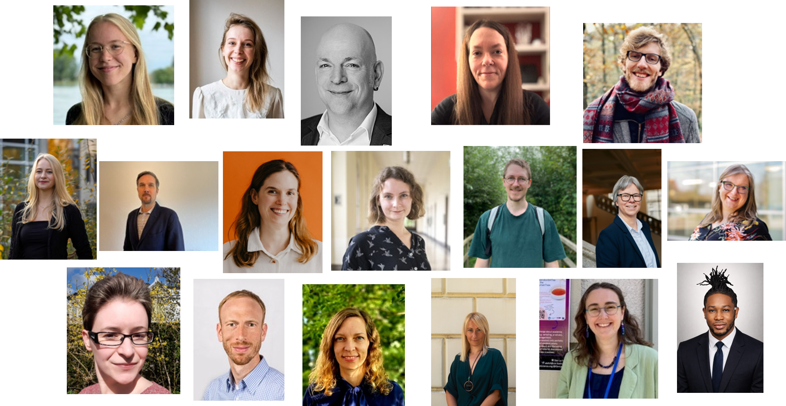
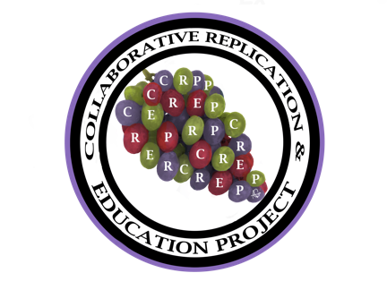
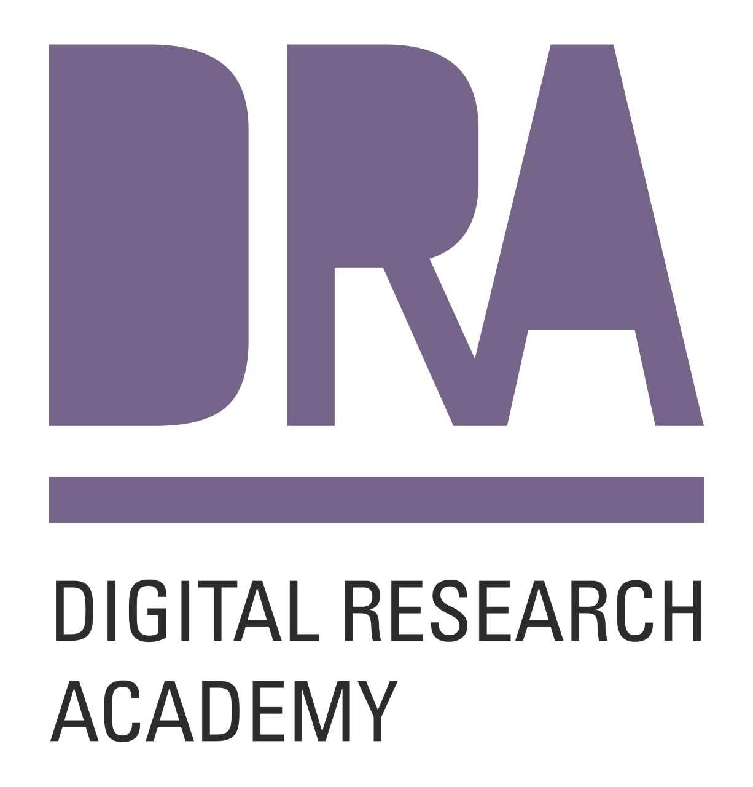

# *Love Replications Week*

Granting replications the spotlight for one entire week - learn about best practices, get in touch with experts, and join an open community!

{fig-align="center"}

## WHAT IS THE LOVE REPLICATIONS WEEK?

In the *Love Replications Week*, you can **learn how to do reproduction and replication studies yourself**, **submit your own local or virtual events**, **and show your love for replications — regardless of the type of research that you do!**

### Why is that important?

A central feature of research is that others should be able to repeat the procedure and arrive at the same conclusions. In practice, this can be a *reproduction* - repeating a test using the same data - or a *replication* - repeating a test with different data. Historically, these repetitions have been deemed important but rarely conducted, leading to problems of repeatability in many areas across the social sciences, digital humanities, linguistics, and natural sciences.

### How can I contribute?

The 2026 Love Replications Week has concluded. Get in touch if you want to contribute to a replication of this event and join the [FORRT Slack](https://join.slack.com/t/forrt/shared_invite/enQtODMwODI0OTk4ODgzLTM0ZTQ3NDk5MzA1ZjBmNWJjYTVlN2Y2YTk0ZTJhYTY5NDliMDYzMjg2MWE0ZDRhOTY0ZDY3OTRlNDA4ODQ3NjQ) to stay up-to-date.

{fig-align="center"}

## 2026 Program

*From March 2-6, a group of 17 speakers gave talks, tutorials, and workshops on a variety of topics surrounding reproduction and replication research.*

{width="800"}

### **Monday, March 2nd**

-   **Reproducibility in the language sciences: What, why and how** by [Elen Le Foll](https://elenlefoll.eu) and [Mara van der Ploeg](https://en.uit.no/ansatte/mara.ploeg) (10:00 - 11:30 am, online), [slides](https://doi.org/10.5281/zenodo.18903438)\
    *In the first half of this talk, Elen will present the results of various attempts to computationally reproduce the results of published quantitative linguistics studies based on the authors' original data. We discuss the factors that led to successful reproductions and those that hindered the process. In the second half, we ask: Where can we find good linguistics data and where to store your data? Answering these questions, Mara introduces TROLLing (The Tromsø Repository of Language and Linguistics), a curated, domain-specific repository that will keep your data safe and accessible long-term.*\

    

-   **Reproducibility Study Speedrun** by [Lenka Fiala](https://www.lenkafiala.com) (1:00 - 1:30 pm CET, online), [slides](https://doi.org/10.5281/zenodo.18823102){width="80"}\
    *To investigate the transparency, correctness, and generalizability of a study, researcher can attempt to reproduce the results. Participants will be guided through an example reproduction study.*

    

-   **Multiverse Analysis for Reporting Robustness to Analytical Flexibility** by [Cassie Short](https://uol.de/psychologie/statistik/cassie-short) (3:00 - 3:45 pm CET, online), [slides](https://doi.org/10.5281/zenodo.18838199) {width="22"}{width="37"}\
    *Multiverse analysis is a comprehensive and systematic approach to reporting the robustness of results across the defensible “garden of forking paths.” It does so by systematically specifying and computing all defensible combinations of analytic decisions applied to a single dataset, and reporting the result obtained from each. By explicitly acknowledging analytical uncertainty, multiverse analysis increases transparency and reduces the risk of overstating robustness and reproducibility.*

    

### **Tuesday, March 3rd**

-   **The ReproCheck project – Supporting economics journals with data policies and reproducibility checks** by [Marianne Saam](https://www.zbw.eu/de/ueber-zbw/profil/mitarbeiterprofile/profil-prof-dr-marianne-saam) and [Sven Vlaeminck](https://www.zbw.eu/de/ueber-zbw/profil/mitarbeiterprofile/profil-sven-vlaeminck) (10:15 - 11:00 am CET, online), [slides](https://doi.org/10.5281/zenodo.18847413)\
    *The ZBW – Leibniz Information Centre for Economics hosts the Journal Data Archive, a service for journals. Since 2025, the archive is developing a pilot service that aims at supporting journals with upgrading data policies and introducing reproducibility checks. The project is funded by Volkswagen Foundation. We will present the project approach and first experiences.*

-   **Conducting Computational Reproductions: A Guide for Teachers and Students** by [Nate Breznau](https://sites.google.com/site/nbreznau/) (11:15 am - 12:00 CET, online), [slides](https://doi.org/10.5281/zenodo.18847868)\
    *How to engage in a computational replication of pre-existing results? Provides reasons for doing the computational reproduction, reasonable expectations to have, reasons to adjust or expand the reproduction into a re-analysis, a reasonable timeline, tips for engaging with the original authors and how to publish results.*

    

-   **How to get your reproducibility certificate with CODECHECK** by [Daniel Nüst](https://github.com/nuest) (1:00 - 1:30 pm CET, online), [slides](https://doi.org/10.5281/zenodo.18849085) {width="39"}\
    [*CODECHECK*](https://codecheck.org.uk) \*provides an approach for independent execution of computations underlying research articles. During the publication process, one reviewer - the codechecker - certifies that they was able to execute relevant parts of a computational workflow. This certificate becomes part of the public record.\

    

### **Wednesday, March 4th**

-   **How to find a replication target** by [Lukas Wallrich](lukaswallrich.coffee) (1:00 - 1:30 pm CET, online), [slides](https://doi.org/10.5281/zenodo.18808378) {width="63"} {style="font-size: 11pt;" width="91" height="20"}

    *Most published studies have not been subject to replication attempts yet and given limited resources for replication research, we need to priotize what to replicate (first). This walk will run participant through several criteria that can help researchers choosing what to replicate.*\

    

-   **Replication Journal Showcase** by [Thomas Evans](https://thomas-rhys-evans.netlify.app), [Etienne Roesch](https://etienneroes.ch), [Nina Ehmann](https://etienneroes.ch), [Alexandra Sarafoglou](https://www.linkedin.com/in/asarafoglou/), [Marianne Saam](https://www.zbw.eu/de/ueber-zbw/profil/mitarbeiterprofile/profil-prof-dr-marianne-saam), [Lukas Röseler](https://lukasroeseler.github.io/home/) (4:00 - 5:00 pm CET, online), [JRR slides](https://doi.org/10.5281/zenodo.18865086), [R2 slides](https://doi.org/10.5281/zenodo.18758426) {width="63"}*Learn about academic journals that have a strong focus on reproduction and replication studies. Members of the respective editorial boards will present [Rescience C](https://rescience.github.io), [Rescience X](http://rescience.org/x), the [Journal of Comments and Replications in Economics](https://jcr-econ.org), the [Journal of Robustness Reports](https://scipost.org/JRobustRep/about), the [Journal of Open Psychology Data](https://openpsychologydata.metajnl.com/), and [Replication Research](https://www.uni-muenster.de/Ejournals/index.php/replicationresearch/index).*

\

### **Thursday, March 5th**

-   **Getting your replication report ready for submission** by [Lukas Röseler](https://lukasroeseler.github.io/home/) (1:00 - 1:30 pm CET, online), [slides](https://doi.org/10.5281/zenodo.18757229) {width="63"}{style="font-size: 11pt;" width="91" height="20"}\
    *Reports of reproduction or replication studies are fundamentally different from traditional articles in that there is always a predecessor or target study. To facilitate transparent and comprehensive reporting, participants will learn about manuscript templates and examples of best practices for reporting replications and reproductions.* 

-   **Large scale replications vs. Meta-analyses: Lessons learned in developmental science** by [Christina Bergmann](https://sites.google.com/site/chbergma/) (2:30 - 3:30 pm CET, online)\
    *In developmental science, we typically test small samples of a very noisy population, so both meta-analyses and replications seem like a logical answer to the question, how robust results really are. But what can we learn from each and how do both fare when combined?*

    

-   **Replication Research with Students via the Collaborative Replication and Education Project (CREP)** by [Lili Lazarevic](https://lira.f.bg.ac.rs/ljiljana-lazarevic-en/) and [Jordan Wagge](https://jordanwagge.com/) (3:30 - 4:00 pm CET), [slides](https://doi.org/10.5281/zenodo.18936899){width="26" height="20"}\
    *We will describe the Collaborative Replications and Education Project (CREP), a framework that involves students in contributing to science via replication projects. We will present the project products from the past 10+ years and describe the student experience and learning outcomes. Finally, we will discuss ways that students, instructors, and researchers can get involved with CREP.*

    

-   **Getting started: Writing reproducible manuscripts using R Markdown** by [Maren Klingelhöfer-Jens](https://www.uke.de/allgemein/arztprofile-und-wissenschaftlerprofile/wissenschaftlerprofilseite_maren_klingelhöfer-jens.html) (4:00 - 5:00 pm CET, online), [slides](https://doi.org/10.5281/zenodo.18886525) and [github repo](https://github.com/m-klingelhoefer-j/Writing_reproducible_manuscripts) {width="22"}{width="37"}\
    *This introductory session provides an overview of the basics of R Markdown, including how to create, format, and render documents, as well as integrate code, data, figures, tables, and references. In addition, participants will be guided through specific R Markdown templates that can be used to create APA-compliant, publication-ready manuscripts. Some prior knowledge of R programming will be helpful for following this session.*

    

### **Friday, March 6th**

-   **Cooperation with students to conduct replication studies** by [Susanne Adler](https://linktr.ee/susanneadler) (1:00 - 1:30 pm CET, online) {width="91" height="20" style="font-size: 11pt;"}\
    *Replication studies are a superb way to train (under-)graduate students in research methods. The thorough evaluation of the original study, the use of contemporary statistical methods, and practical applications of preregistration and data management provide students with a profound understanding of empirical research. The acquired skills do not just shape how future scientists and practitioners approach research, but the gathered evidence also contributes to strengthening a research field’s knowledge base. This talk outlines how state-of-the-art replication studies can be integrated into a seminar, what to look out for as a lecturer during these seminars, and describes an example study.*

    

-   **Workshop: Promoting Robust Science Through Reanalyses** by [Nina Ehmann](https://www.linkedin.com/in/ninaehmann/) and [Alexandra Sarafoglou](https://www.linkedin.com/in/asarafoglou/) (1:30 - 3:00 pm CET, online), [slides](https://doi.org/10.5281/zenodo.18890221) {width="17"}\
    *In published empirical studies, it often remains unclear to what extent the conclusions depend on the chosen analysis pipeline. To address this, we founded the [Journal of Robustness Reports](https://www.journalofrobustnessreports.org/) (JRR), a diamond open-access journal that publishes concise re-analyses of potentially impactful empirical findings. In this workshop, participants will re-analyze a published study and begin drafting a Robustness Report that they can later [submit to the journal](https://scipost.org/JRobustRep). Interested participants can already familiarize themselves with the target article: <https://doi.org/10.1038/s41562-023-01538-4>.*

{fig-align="center"}

::: logo-stack
## Materials
:::

{fig-align="center"}

## Partners

[{width="150"}](https://codecheck.org.uk) [{width="150"}](https://www.crep-psych.org)[{width="96" style="font-size: 11pt;"}](https://digital-research.academy) [{width="150"}](https://i4replication.org) {width="110"}

[{width="150"}](jcr-econ.org) [{width="150"}](https://scipost.org/JRobustRep/about){width="222" height="49"}

[{width="150"}](https://www.osc.uni-muenchen.de/index.html) [{width="150"}](https://reproducibilitynetwork.de)[{width="341"}](https://www.cos.io)

{fig-align="center"}

## Organizers

[{width="150"}](https://www.uni-muenster.de/MueCOS/en/index.html)

[{width="150"}](https://forrt.org)
